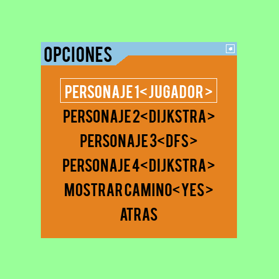

# Bomberman 

Copia de Bomberman escrito en python, usando las librerias Pygame y Pygame-menu

Juego disponible para jugar contra dos tipos de IA( el Algoritmo de Dijkstra y Depth-first search)
 

 
## Controles 
Flechas -  Movimiento

Space bar - Poner Bomba 
 
## Ejecutar 
Para iniciar este juego necesitas instalar un entorno virtual con las biblioteca pygame y pygame-menu,
despues ejecuta el juego con el siguiente comando:

`` 
python3 menu.py 
`` 
